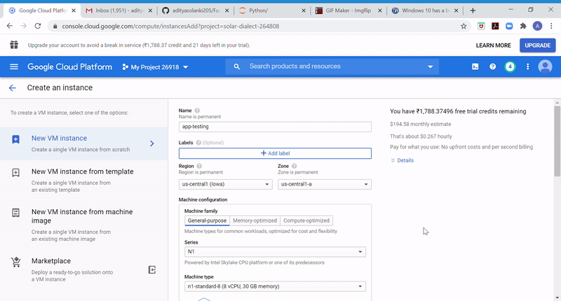
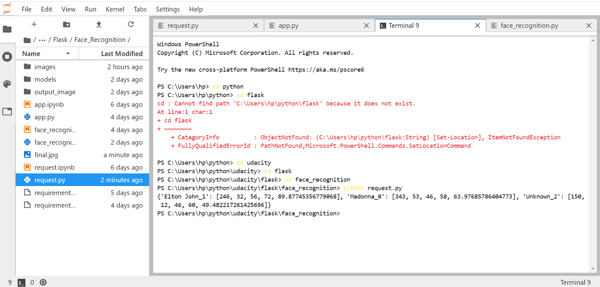

# Facial Recognition

This is a Facial Recognition application developed for **learning and implementation purpose only**. In this repository we will just implement this application using Flask Architecture to run it on Google Cloud. The complete process to Train and test is present [here](https://github.com/adityasolanki205/Face-Recognition)
This model is trained to detect and recognise faces of six individuals namely Aditya Solanki(Author), Ben Affleck, Madonna, Elton John, Jerry Seinfled, Mindy Kaling. Here complete process is divided into 2 parts:

1. **Setting up the Application on Google Cloud**
2. **Implementation of model to recognise the faces**


## Motivation
For the last one year, I have been part of a great learning curve wherein I have upskilled myself to move into a Machine Learning and Cloud Computing. This project was practice project for all the learnings I have had. This is first of the many more to come. 
 

## Libraries/framework used

<b>Built with</b>
- [Keras](https://keras.io/)
- [TensorFlow](https://www.tensorflow.org/)
- [scikit-learn](https://scikit-learn.org/stable/)
- [Flask](https://flask.palletsprojects.com/en/1.1.x/)


## Code Example

```bash
    # clone this repo:
    git clone https://github.com/adityasolanki205/Face-recognition-on-flask.git
```

## Installation

Below are the steps to setup the enviroment and run the codes:

1. **Cloud account Setup**: First we will have to setup free google cloud account which can be done [here](https://cloud.google.com/free). 

2. **Creating a Google Compute instance**: Now we have to create a Compute Engine Instance to deploy the app. To do that we will use **n1-standard-8** as it has larger processing power. For Boot Disk we will select **Ubuntu 18.04 LTS**. Also tick on the Allow Http traffic label to send/receive requests create the instance.



3. **Deploying the App on Compute Engine**: After creating the instance, we will deploy the code on the instance using SSH. So click on the SSH button to session to deploy out code.

```bash
    # update system packages and install the required packages
    sudo apt-get update
    sudo apt-get install bzip2 libxml2-dev libsm6 libxrender1 libfontconfig1
    
    # clone the project repo
    git clone https://github.com/adityasolanki205/Face-recognition-on-flask.git
    
    # download and install miniconda
    wget https://repo.anaconda.com/miniconda/Miniconda3-4.7.10-Linux-x86_64.sh
    bash Miniconda3-4.7.10-Linux-x86_64.sh
    
    export PATH=/home/<your name here>/miniconda3/bin:$PATH
    
    rm Miniconda3-4.7.10-Linux-x86_64.sh
    
    # confirm installation
    which conda
```


4. **Running the App**:  Now we will run the app on the Instance

```bash
    # Installing all the dependencies
    pip install -r requirements.txt
    
    # Running the app 
    python app.py
```


5. **Creating a POST request from Local**: After this we will create a POST request from the local. To do that we will just run request.py from local. Only one thing has to be changed in the request.py file i.e. the IP address of the instance. Copy the external IP of the instance from Google cloud Console and paste in the request.py file

```python
    import requests
    import json
    import cv2
    import PIL
    from PIL import Image , ImageDraw, ImageFont


    url = "http://<Your IP address>:5000/predict"
    headers = {"content-type": "image/jpg"}
    filename = 'images/singers.jpg'
```


6. **See magic happen**: Run Request.py file and see Face recognition happening on Google Cloud. This will save a Final.jpg file containing the faces.


## Tests
To test the code we need to do the following:

    1. Copy the photo to be tested in 'Test' subfolder of 'Data' folder. 
    Here I have used a photo of Elton John and Madonna

    
    2. Goto the 'Predict face in a group' folder.
    
    3. Open the 'Predict from a group of faces.ipynb'
    
    4. Goto filename variable and provide the path to your photo. Atlast run the complete code. 
    The recognised faces would have been highlighted and a photo would be saved by the name 'Highlighted.jpg'


**Note**: The boundary boxes are color coded:

    1. Aditya Solanki  : Yellow
    2. Ben Affleck      : Blue   
    3. Elton John      : Green
    4. Jerry Seinfield : Red
    5. Madonna         : Aqua
    6. Mindy Kaling    : White
    
## How to use?
To run the complete code, follow the process below:

    1. Create Data Folder. 
    
    2. Create Sub folders as Training and Validation Dataset
    
    3. Create all the celebrity folders with all the required photos in them. 
    
    4. Run the Train and Test Data.ipynb file under Training Data Creation folder
    
    5. Save the output as numpy arrays
    
    6. Run the Face embedding using FaceNet.ipynb under the same folder name. This will create training data for SVM model
    
    7. Run the Predict from a group of faces.ipynb to recognise a familiar face

## Credits
1. David Sandberg's facenet repo: [https://github.com/davidsandberg/facenet](https://github.com/davidsandberg/facenet)
2. Tim Esler's Git repo:[https://github.com/timesler/facenet-pytorch](https://github.com/timesler/facenet-pytorch)
3. Akash Nimare's README.md: https://gist.github.com/akashnimare/7b065c12d9750578de8e705fb4771d2f#file-readme-md
4. [Machine learning mastery](https://machinelearningmastery.com/how-to-develop-a-face-recognition-system-using-facenet-in-keras-and-an-svm-classifier/)
