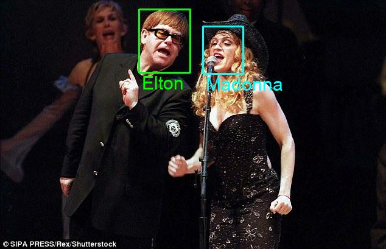

# Facial Recognition

This is a Facial Recognition application developed for **learning and implementation purpose only**. In this repository we will just implement this application using Flask Architecture to run it on Google Cloud. The complete process to Train and test is present [here](https://github.com/adityasolanki205/Face-Recognition)
This model is trained to detect and recognise faces of six individuals namely Aditya Solanki(Author), Ben Affleck, Madonna, Elton John, Jerry Seinfled, Mindy Kaling. Here complete process is divided into 2 parts:

1. **Setting up the Application on Google Cloud**
2. **Implementation of model to recognise the faces**


## Motivation
For the last one year, I have been part of a great learning curve wherein I have upskilled myself to move into a Machine Learning and Cloud Computing. This project was practice project for all the learnings I have had. This is first of the many more to come. 
 

## Libraries/framework used

<b>Built with</b>
- [Keras](https://keras.io/)
- [TensorFlow](https://www.tensorflow.org/)
- [scikit-learn](https://scikit-learn.org/stable/)
- [Flask](https://flask.palletsprojects.com/en/1.1.x/)


## Code Example

```bash
    # clone this repo:
    git clone https://github.com/adityasolanki205/Face-recognition-on-flask.git
```

## Installation

Below are the steps to setup the enviroment and run the codes:

1. **Cloud account Setup**: First we will have to setup free google cloud account which can be done [here](https://cloud.google.com/free). 

2. **Creating a Google Compute instance**: Now we have to create a Compute Engine Instance to deploy the app. To do that we will use n1-standard-8 as it has larger processing power. For Boot Disk we will select Ubuntu 18.04 LTS. Also in the Firewall section we will tick on the Allow Http traffic label to send/receive requests. At last we will create the instance. The created instance will look like


3. **Face Embeddings**: After face extraction we will fetch the face embedding using [FaceNet](https://github.com/davidsandberg/facenet). Downloaded the model [here](https://drive.google.com/drive/folders/1pwQ3H4aJ8a6yyJHZkTwtjcL4wYWQb7bn). After running this code for all the faces in train and test folders, we can save the embeddings using [np.saves_compressed](https://numpy.org/doc/stable/reference/generated/numpy.savez_compressed.html)

```python
    # The Dimension of the input has to be increased as the model expects input in the form (Sample size, 160, 160,3)
    samples = np.expand_dims(image_pixels, axis = 0)
    
    # Use the Predict method to find the Embeddings in the face. Output would be 1D vector of 128 embeddings of that face
    embeddings = model.predict(samples)
```

4. **Training the SVM model on these Embeddings**:  Now we will train SVM model over the embeddings to predict the face of a person.

```python
    # We will use Linear SVM model to train over the embeddings
    model = SVC(kernel = 'linear', probability=True).fit(X_train,y_train)
```

5. **Predict the Face**: After the training of SVM model we will predict the face over test dataset.

```python
    # Preprocessing of the test photos have to be done like we did for Train and Validation photos
    image = np.asarray(image.convert('RGB'))
    
    # Now extract the face
    faces = MTCNN.detect_faces(image)
    
    # Extract embeddings
    embeddings = model.predict(samples)
    
    # At last we will predict the face embeddings
    SVM_model.predict(X_test)
```

## Tests
To test the code we need to do the following:

    1. Copy the photo to be tested in 'Test' subfolder of 'Data' folder. 
    Here I have used a photo of Elton John and Madonna

    
    2. Goto the 'Predict face in a group' folder.
    
    3. Open the 'Predict from a group of faces.ipynb'
    
    4. Goto filename variable and provide the path to your photo. Atlast run the complete code. 
    The recognised faces would have been highlighted and a photo would be saved by the name 'Highlighted.jpg'


**Note**: The boundary boxes are color coded:

    1. Aditya Solanki  : Yellow
    2. Ben Affleck      : Blue   
    3. Elton John      : Green
    4. Jerry Seinfield : Red
    5. Madonna         : Aqua
    6. Mindy Kaling    : White
    
## How to use?
To run the complete code, follow the process below:

    1. Create Data Folder. 
    
    2. Create Sub folders as Training and Validation Dataset
    
    3. Create all the celebrity folders with all the required photos in them. 
    
    4. Run the Train and Test Data.ipynb file under Training Data Creation folder
    
    5. Save the output as numpy arrays
    
    6. Run the Face embedding using FaceNet.ipynb under the same folder name. This will create training data for SVM model
    
    7. Run the Predict from a group of faces.ipynb to recognise a familiar face

## Credits
1. David Sandberg's facenet repo: [https://github.com/davidsandberg/facenet](https://github.com/davidsandberg/facenet)
2. Tim Esler's Git repo:[https://github.com/timesler/facenet-pytorch](https://github.com/timesler/facenet-pytorch)
3. Akash Nimare's README.md: https://gist.github.com/akashnimare/7b065c12d9750578de8e705fb4771d2f#file-readme-md
4. [Machine learning mastery](https://machinelearningmastery.com/how-to-develop-a-face-recognition-system-using-facenet-in-keras-and-an-svm-classifier/)
